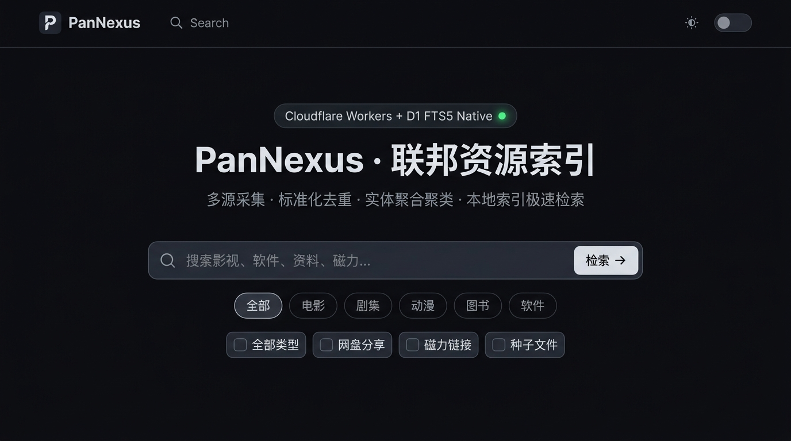

<div align="center">

# PanNexus

**Next-Gen Federated Cloud Drive & Magnet Indexing Engine**

Built with Nuxt 3 + Cloudflare Pages + D1 (SQLite FTS5) + Queues + Cron Triggers

[](LICENSE)
[](tests/)
[](https://pages.cloudflare.com/)
[](https://vuejs.org/)
[](https://www.typescriptlang.org/)

[English](./README_EN.md) · [简体中文](./README.md) · [Production Deployment Guide](./DEPLOY.md)

</div>

---

## Interface Preview



---

## Architectural Motivation

Traditional web scraping aggregators usually suffer from critical design flaws:
- **Synchronous Crawling Latency**: Scraping dozens of upstream sites concurrently on every user keystroke causes 5–15 second wait times and fragile timeouts whenever an upstream provider is degraded or rate-limited;
- **Duplicate Explosion**: Identical movies, TV episodes, or software packages exist across various cloud drives without fingerprint-level deduplication or canonical entity clustering;
- **Polluted Dead Links**: Query results are often contaminated with promotional spam, invalid shares, and dead torrents without health verification.

**PanNexus resolves these issues with a decoupled two-tier architecture: "Local Index First, Federated Streaming Supplement":**
1. **Local-First D1 Index (Sub-80ms P50)**: Search requests query Cloudflare D1 distributed SQLite database using native FTS5 full-text indexing, delivering instant responses under heavy traffic;
2. **On-Demand Live Deep Search**: When fresh external items are needed, users can trigger deep search. PanNexus broadcasts requests across active adapters via Server-Sent Events (SSE), and **asynchronously ingests verified records back into D1**;
3. **Background Cron & Dead-Letter Queue (DLQ)**: An isolated Cloudflare Worker periodically harvests public feeds (Nyaa, DMHY, Telegram public channels, Torznab, AList). Jobs failing 3 times are sequestered into `failed_jobs` for dead-letter retry operations.

---

## Architecture Topology

```
                       ┌───────────────────────────────┐
                       │          Browser User         │
                       └──────────────┬────────────────┘
                                      │
            ┌─────────────────────────┴─────────────────────────┐
            │                                                   │
    [Local Search (P50 < 80ms)]                         [Live Deep Search (SSE)]
            │                                                   │
            ▼                                                   ▼
┌───────────────────────┐                             ┌───────────────────┐
│ Cloudflare Pages      │                             │ SSE Push Stream   │
│ Nuxt 3 Nitro API      │                             └─────────┬─────────┘
└───────────┬───────────┘                                       │
            │ (Query)                                           │ (Async Ingest)
            ▼                                                   │
┌───────────────────────┐                                       │
│ Cloudflare D1 (FTS5)  │◄──────────────────────────────────────┘
│ url_hash / infohash   │
│ UNIQUE Constraint &   │
│ Canonical Clustering  │
└───────────▲───────────┘
            │ (Scheduled Upsert)
┌───────────┴───────────┐        Internal Auth Proxy  ┌─────────────────────────┐
│ Cloudflare Pages API  │◄──────────────────────────│ Cloudflare Worker       │
│ /api/v1/internal/*    │  (Bearer METASEEK_CRON)   │ Cron Scheduler (*/30)   │
└───────────────────────┘                           │ Queue Consumer (Batch)  │
                                                    └─────────────────────────┘
```

---

## Key Features

- **Zero Fake Data Policy**: Strictly refrains from keyword-based URL fabrication. Integrates only genuine public protocols and APIs (Nyaa RSS, DMHY RSS, Torznab/Jackett, Telegram public web views, AList v3).
- **Strict Deduplication & Fingerprinting**: High-performance `UNIQUE` indexing on `url_hash` and `infohash` ensures conflict resolution and automatic `last_seen_at` freshness updates.
- **Canonical Clustering & Multi-dimensional Scoring**: Raw resources are normalized into Canonical Entities, dynamically ranked by title relevance, seeders count, file size completeness, and discovery timestamp.
- **End-to-End Compliance Filtering**: Multi-layer blacklists intercept spam keywords, toxic domains, and blocked BTIH hashes across crawling, deep search streaming, and database queries.
- **Hardened Security**:
  - Sliding-window in-memory rate limiting (60 req/min for general search, 15 req/min for deep search, 5 req/min for admin login);
  - SSRF protection against private CIDRs, loopbacks, and cloud metadata endpoints;
  - Admin session authentication eliminating default weak passwords.
- **Visual Admin Console**: Real-time adapter health scoring, circuit breaker inspection, and dead-letter queue management.

---

## Tech Stack

- **Frontend**: [Nuxt 3](https://nuxt.com/) (Vue 3, TypeScript, Composition API)
- **UI Design**: Tailwind CSS (Linear / Vercel Minimalist aesthetics, adaptive Dark Mode, Lucide Icons)
- **Edge Runtime**: Cloudflare Pages + Cloudflare Workers (Node.js compatibility mode)
- **Storage**: Cloudflare D1 (Distributed SQLite + FTS5 Full-Text Search) + Cloudflare KV
- **Queues & Scheduling**: Cloudflare Queues + Cron Triggers (`*/30 * * * *`)
- **Testing**: [Vitest 3](https://vitest.dev/) (27 test suites, 112 unit tests passing)

---

## Quick Start

### Prerequisites
- Node.js >= 18.0.0
- pnpm >= 9.0.0

### 1. Clone and Install Dependencies

```bash
git clone https://github.com/your-username/pannexus.git
cd pannexus
pnpm install
```

### 2. Initialize Local D1 Database

```bash
# Sets up schema, applies unique index migrations, and populates seed data
pnpm db:setup
```

### 3. Run Unit Tests

```bash
pnpm test
```
> All 27 test files and 112 test cases pass cleanly out-of-the-box.

### 4. Start Development Server

```bash
pnpm dev
```
Open `http://localhost:3000` in your browser.

> **Windows Quick Start**: Double click `start.bat` or run `.\start.ps1` in PowerShell for an interactive launcher.

---

## Environment Variables (`.env`)

Copy the configuration template:

```bash
cp .env.example .env
```

Configure relevant keys as needed:

```env
# Administrator console secret (access /admin)
METASEEK_ADMIN_TOKEN=your-strong-admin-token

# Internal token shared between Cloudflare Worker and Pages
METASEEK_CRON_SECRET=your-internal-cron-secret

# Optional upstream credentials
TORZNAB_URL=
TORZNAB_API_KEY=
ALIST_BASE_URL=
ALIST_TOKEN=
TMDB_API_KEY=
```

---

## Production Deployment

Refer to [DEPLOY.md](./DEPLOY.md) for full Cloudflare topology setup.

Quick deployment steps:

```bash
# 1. Create remote D1 database and Queue
npx wrangler d1 create metaseek-db
npx wrangler queues create metaseek-crawl-queue

# 2. Apply remote database schema and migrations
npx wrangler d1 execute metaseek-db --remote --file=./database/schema.sql
npx wrangler d1 execute metaseek-db --remote --file=./database/migrations/0003_dedup_and_jobs.sql

# 3. Build & deploy Pages frontend
pnpm build
pnpm deploy:pages

# 4. Deploy background crawler Worker
pnpm deploy:crawler
```

---

## Disclaimer

1. This software is provided for educational and research purposes only. It does not store or host any media files directly;
2. All index metadata is queried from publicly accessible open networks. Please comply with local laws and regulations.

---

## License

Distributed under the [Apache-2.0 License](./LICENSE).
